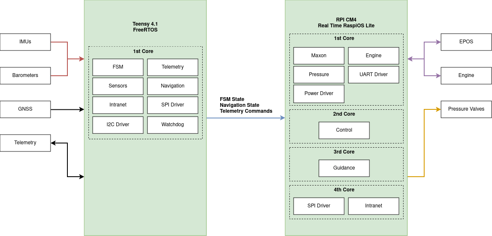

# Icarus Commander

This is a C++ proof of concept program designed to demonstrate task management on a multi-core system running a real-time operating system. The program uses **CPU affinity** to bind tasks (threads) to specific cores and applies **real-time scheduling policies** to assign priorities to each task. It is specifically designed for systems running **Raspberry Pi OS with the PREEMPT_RT patch**, which supports real-time scheduling.

It is based on the [Real Time Linux project documentation](https://wiki.linuxfoundation.org/realtime/documentation/start) and the [Avionics Software Diagram](https://rocket-team.epfl.ch/en/icarus/avionics/2024_I_AV_OVERVIEW)



The aim of this program will be to manage all of the tasks running on the Raspberry Pi.


## Copy files to the raspberry pi
You can easily copy the entire project to the raspberry pi by running:
```
rsync * username@pi.local:destination/path --exclude='/.git' -v
```
Be sure to modify the username and destination path to correspond to the device you are using.

## Compilation
First, you need to update dependencies:
```
make depend
```

Then, once connected to the rpi, compile the executable by running:
```
make rocket
```

## Execution
You need sudo privileges in order to set a scheduling policy to a thread. Don't forget to use sudo!
```
sudo ./rocket
```

## Debugging
The `ps` utility can be use to list running processes.
By default, `ps` only shows proccesses associated with the current user and terminal.
This is not very useful, as it is usually run from another terminal (like a second ssh connexion). In addition, `ps` doesn't show threads and realtime attributes if run without arguments. Therefore, I suggest using the following command:
```
ps -eLo start,pid,user,policy,rtprio,psr,command
```
Explanation:
- `-e` List all running processes
- `-L` Include threads
- `-o` Format according to the format string

Format:
- **start**: time the command started
- **pid**: a number representing the process ID
- **user**: effective user name
- **policy**: scheduling policy ("**TS**": SCHED_OTHER, "**FF**": SCHED_FIFO, "**DLN**": SCHED_DEADLINE, "**-**": not reported, "**?**": unknown)
- **rtprio**: Real-time priority (if applicable)
- **psr**: processor that process is currently assigned to
- **command**: command name

Additional information can be found in the manual: `man ps`  
Finally, to only show our processes, one can pipe the output of `ps` into `grep`:
```
ps -eLo start,pid,user,policy,rtprio,psr,command | grep '[r]ocket'
```
We use brackets to avoid matching the grep program itself.

## Questions
- Do we need to pass parameters to the task function?
- How should tasks communicate?
- Should we monitor tasks?
- Should we set a stack size and lock memory?

## Possible ameliorations
- Monitoring
- Parameters passing
- Stop and destroy tasks(destructor for Task)
